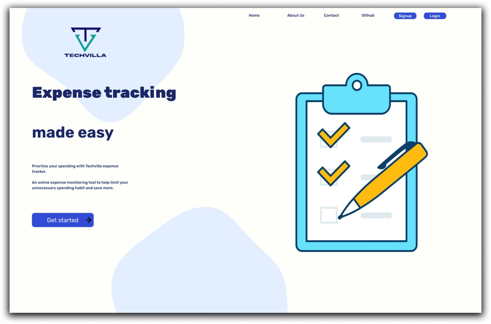
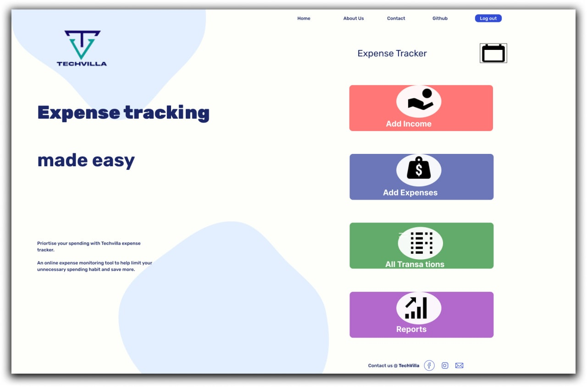

# Techvilla Expense tracker

## Welcome! 👋

Thanks for checking out this project.

[Techathon community](https://t.me/mentorshipandopensource) project helps you improve your coding skills by building realistic projects and also the ability to collaborate.

## The challenge
The expense tracker is built to enable users track their expenses monthly. It will enable users to minimize wasteful spending, calculate and monitor their monthly income. 

Our users would be able to: 

- Add their incomes and expenses
- See all transactions made through the month
- Include their monthly budget 
- Also get a report 

## Where to find everything

The task is to build out the project to the designs inside the `/design` folder. You will find both a mobile and a desktop version of the design. 

The designs are in JPG static format. Using JPGs will mean that you'll need to use your best judgment for styles such as `font-size`, `padding` and `margin`. 

If you would like the design files (we provide Sketch & Figma versions) to inspect the design in more detail, you can [see Figma file](https://www.figma.com/file/vKfD99j2RJMNrRkxUe1u2P/Techvilla?node-id=0%3A1).

You will find all the required assets in the `/asset` folder. The assets are already optimized.

## Building your project

The app is built with
- semantic HTML 5
- CSS Grid
- CSS Custom Properties
- CSS 3
- Javascript

## Project Dependency
- Os version before installing

## Authors
[Ibrahim Hassan](https://github.com/Hassanibrahim0617)
[Idisi Efezino ](https://github.com/efezinoidisi)
[Ofure Igberaese](https://github.com/Ofurecole27)
[Afolabi Bisiriyu]()
[Akinsiku Oluwafunke](https://github.com/Christianah05)
[Modupe Ademola]()
[Farouk Ojeifo](https://github.com/Faroukojey)
[Anaele Elisha]()
[Akinlade Florence](https://github.com/CrownfWealth)
[Godwin Gabriel]()
[Akintemi Oluwole]()
[Ufoma Ovolevor](https://github.com/foma4tune)
[Dahud Yusuf](https://github.com/yusfate4)
[Jimoh Jamiu]()

## Live pages
- [GitHub Pages](https://github.com/Group1-Team1/Techvilla-expense-tracker)
- [Vercel](https://vercel.com/)
- [Netlify](https://www.netlify.com/)
